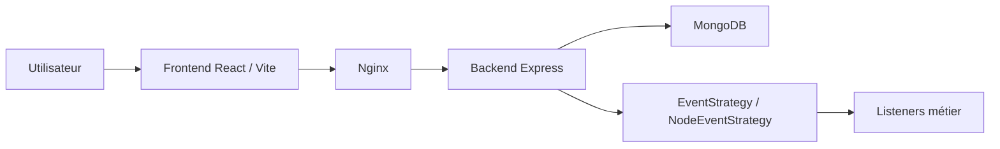

# Meow

Meow est une application open source de gestion de pipeline commercial. Elle permet de suivre des opportunités dans un funnel visuel, de gérer des comptes clients, de personnaliser les champs métier et de produire des prévisions de vente.

Licence : AGPLv3.

## Fonctionnalités principales

- Pipeline de vente configurable par équipe.
- Opportunités avec montant, responsable, date de clôture, suivi et champs personnalisés.
- Comptes clients avec schéma configurable et références croisées.
- Forecast commercial par période, étape et utilisateur.
- Historique d'activité basé sur des événements métier.
- Transfert d'opportunités entre équipes.
- Personnalisation runtime du nom, du logo, du favicon et des couleurs.
- Déploiement Docker avec frontend servi par Nginx et backend Express.

## Architecture en bref

Meow est une application full-stack TypeScript :

- `frontend/` : React 18, Vite, Redux Toolkit, React Router.
- `backend/` : Express.js, API REST, validation AJV, JWT, MongoDB natif.
- MongoDB : stockage des entités métier, schemas, événements et configurations.
- Docker/Nginx : sert le frontend statique et proxy les routes `/api` et `/public` vers le backend.



## Stack technique

| Couche | Technologies |
|---|---|
| Langage | TypeScript |
| Frontend | React 18, Vite, Redux Toolkit, React Router |
| UI | Chakra UI, MUI, Adobe React Spectrum |
| Backend | Express.js, AJV, JWT, bcrypt |
| Base de données | MongoDB, driver natif |
| Tests | AVA, Supertest |
| Build et run | Docker, Nginx, GitHub Actions |
| Logs | Pino |

## Quickstart Docker

Prérequis : Docker et Docker Compose.

```bash
docker-compose up --build
```

L'application locale est disponible sur :

- build local : `http://localhost:3117`
- image release candidate : `http://localhost:3118`

Pour arrêter :

```bash
docker-compose down
```

## Développement local

Prérequis : Node.js 18+, MongoDB accessible.

Backend :

```bash
export MONGODB_URI=mongodb://localhost:27017/meow
export SESSION_SECRET=change-me
export PORT=9000
cd backend
npm install
npm run build
node build/worker.js
```

Frontend :

```bash
cd frontend
npm install
VITE_URL=http://localhost:9000 npm run dev
```

Le frontend Vite écoute par défaut sur `http://localhost:5173`.

## Commandes principales

| Commande | Description |
|---|---|
| `docker-compose up --build` | Lance l'application complète avec MongoDB. |
| `cd backend && npm run build` | Compile le backend TypeScript. |
| `cd frontend && npm run build` | Compile le frontend. |
| `cd frontend && npm run dev` | Lance Vite en développement. |
| `cd backend && URL=http://localhost:9000 npx ava` | Lance les tests d'intégration backend contre un serveur démarré. |

## Documentation

La documentation détaillée est dans [docs/README.md](docs/README.md).

Entrées utiles :

- [Installation](docs/getting-started/installation.md)
- [Démarrage rapide](docs/getting-started/quickstart.md)
- [Architecture](docs/architecture/overview.md)
- [API backend](docs/backend/api.md)
- [Déploiement](docs/infrastructure/deployment.md)
- [Contribution](docs/contributing/coding-standards.md)

## Contribution

Avant toute modification, lire :

- [AGENTS.md](AGENTS.md)
- [Standards de code](docs/contributing/coding-standards.md)
- [Workflow Git](docs/contributing/git-workflow.md)
- [Tests](docs/contributing/testing.md)

Toute modification non triviale doit être documentée dans `journal/YYYY-MM-DD-slug.md`.
