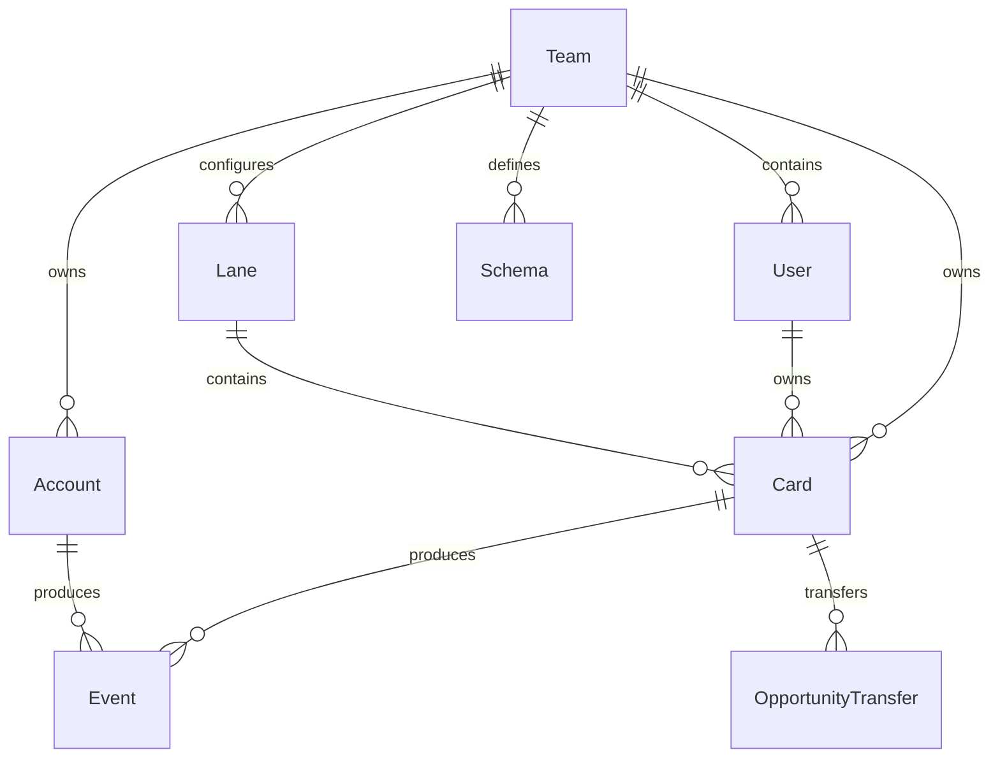

# Base de données

Meow utilise MongoDB avec le driver natif. Le choix est documenté dans [ADR-0001](../../adr/0001-suppression-typeorm-driver-mongodb-natif.md).

## Point d'entrée

Tout accès MongoDB doit passer par :

- `backend/src/helpers/DatabaseHelper.ts`
- `backend/src/helpers/EntityHelper.ts` pour les opérations génériques sur entités.

Ne pas instancier `MongoClient` ailleurs.

## Collections principales

| Collection | Entité | Rôle |
|---|---|---|
| `Cards` | `Card` | Opportunités commerciales. |
| `Accounts` | `Account` | Comptes clients ou contacts. |
| `Lanes` | `Lane` | Étapes du pipeline. |
| `Teams` | `Team` | Organisation, devise, intégrations, labels. |
| `Users` | `User` | Utilisateurs, préférences, board, favoris. |
| `Schemas` | `Schema` | Champs personnalisés des Cards et Accounts. |
| `Events` | `CardEvent`, `AccountEvent`, forecast events | Historique et événements métier. |
| `OpportunityTransfers` | `OpportunityTransfer` | Demandes de transfert d'opportunités entre équipes. |
| `TeamConfigs` | `TeamConfig` | Exports/applications de configuration d'équipe. |

## Modèle conceptuel

## Entités clés

### Card

Une `Card` représente une opportunité :

- `teamId`, `userId`, `laneId`
- `name`, `amount`, `status`
- `closedAt`, `nextFollowUpAt`
- `inLaneSince`
- `attributes` pour les champs personnalisés

Les statuts connus sont `active`, `deleted`, `archived`.

### Account

Un `Account` représente un compte ou contact :

- `teamId`
- `name`
- `status`
- `attributes`
- `references`

Les comptes supprimés passent au statut `deleted`.

### Schema

Un `Schema` décrit les attributs configurables des opportunités ou comptes :

- `type`: `card` ou `account`
- `attributes`: liste ordonnée d'attributs.

Types supportés :

- `text`
- `textarea`
- `select`
- `reference`
- `boolean`
- `email`
- `link`

## Migrations

Il n'existe pas encore de framework de migration MongoDB formalisé dans le projet. Toute évolution de structure doit donc :

- être documentée dans `journal/`;
- prévoir un script explicite si des données existantes doivent être transformées;
- être validée sur une copie de données représentative avant production.

