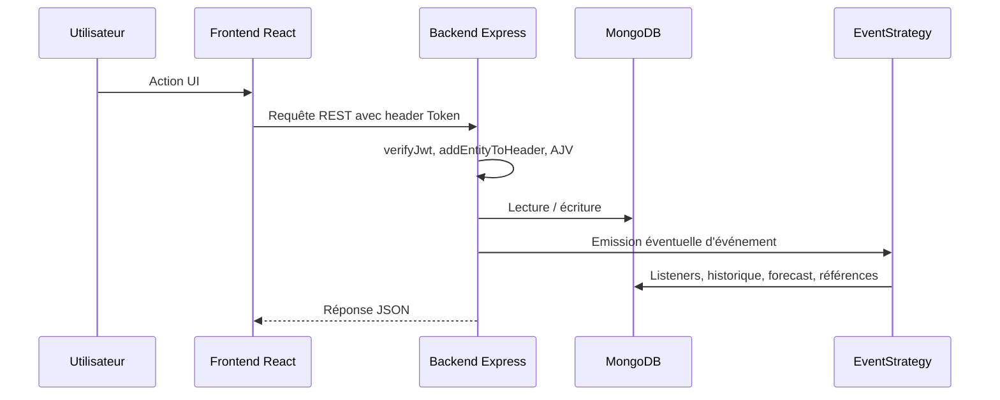

# Vue d'ensemble de l'architecture

Meow est un monolithe web full-stack composé d'un frontend React, d'un backend Express et d'une base MongoDB. Le système est conçu pour être auto-hébergé et personnalisable par variables d'environnement.

## Composants

| Composant | Chemin | Responsabilité |
|---|---|---|
| Frontend | `frontend/src/` | Interface utilisateur, routing, state Redux, appels API. |
| Backend | `backend/src/` | API REST, authentification, validation, logique métier. |
| MongoDB | Externe ou service `db` Docker | Stockage des entités, événements, schemas et configurations. |
| EventStrategy | `backend/src/events/` | Découplage des effets de bord métier. |
| Jobs | `backend/src/jobs/` | Traitements planifiés. |
| Nginx | `nginx.conf` | Serveur statique frontend et proxy API en Docker. |

## Flux principal

## Principes structurants

- Le backend expose une API REST sous `/api` et des routes publiques sous `/public`.
- Les routes authentifiées utilisent `verifyJwt`, `addEntityToHeader`, `setHeaders` et `isDatabaseConnectionEstablished`.
- Les corps POST sont validés par AJV via `backend/src/middlewares/schema-validation/`.
- MongoDB est utilisé via le driver natif et `DatabaseHelper`.
- Les effets de bord métier passent par `EventHelper` et des listeners.
- Le frontend centralise les appels HTTP dans `frontend/src/helpers/RequestHelper.ts`.
- Les données métier globales sont stockées dans Redux.

## Limites actuelles documentées

- L'event bus est in-process : pas de retry, pas de file persistante, pas de dead-letter queue.
- Les tests backend sont des tests d'intégration contre un serveur déjà lancé.
- La stratégie de migration MongoDB reste à formaliser.
- L'observabilité est principalement basée sur les logs Pino.

