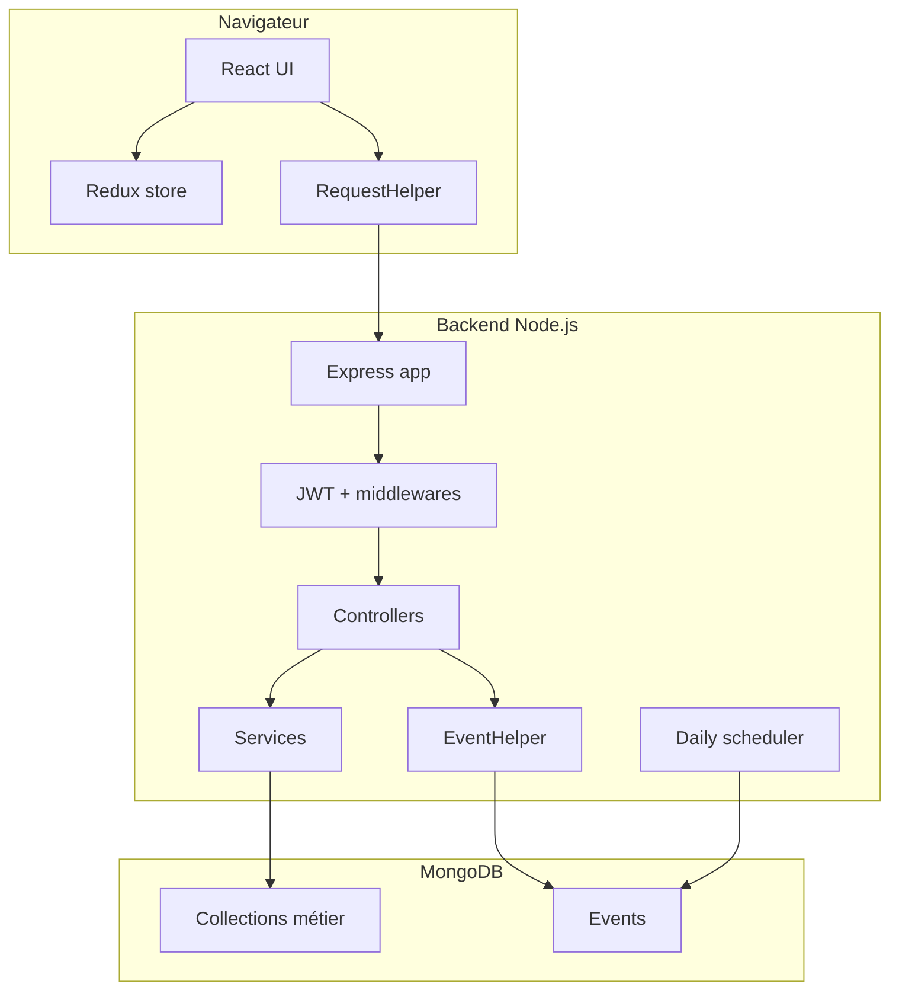

# Design système

## Vue logique

## Découpage backend

| Dossier | Rôle |
|---|---|
| `controllers/` | Handlers HTTP. Ils orchestrent la requête et retournent la réponse. |
| `services/` | Logique métier ou agrégations complexes. |
| `entities/` | Types métier et mapping de collection via décorateur `Entity`. |
| `helpers/` | Accès base, tokens, schemas, entités, événements. |
| `middlewares/` | Authentification, validation, headers, erreurs. |
| `events/` | Stratégie événementielle et listeners. |
| `jobs/` | Tâches planifiées. |
| `tests/` | Tests d'intégration AVA. |

## Découpage frontend

| Dossier | Rôle |
|---|---|
| `pages/` | Pages routées principales. |
| `components/` | Composants UI réutilisables. |
| `store/` | Store Redux, middlewares et sélecteurs. |
| `reducers/` | Reducer applicatif principal. |
| `helpers/` | Utilitaires frontend, dont `RequestHelper`. |
| `interfaces/` | Types TypeScript partagés côté UI. |
| `hooks/` | Hooks React spécialisés. |

## Couplages importants

- `Card`, `Account`, `Lane`, `Schema`, `User` et `Team` sont les entités centrales.
- Les schemas configurables permettent d'ajouter des attributs sans modifier les collections MongoDB.
- Les références entre comptes et opportunités sont stockées dans les attributs et synchronisées par listeners/services.
- Le forecast dépend des lanes, des dates de clôture et des événements forecast.

