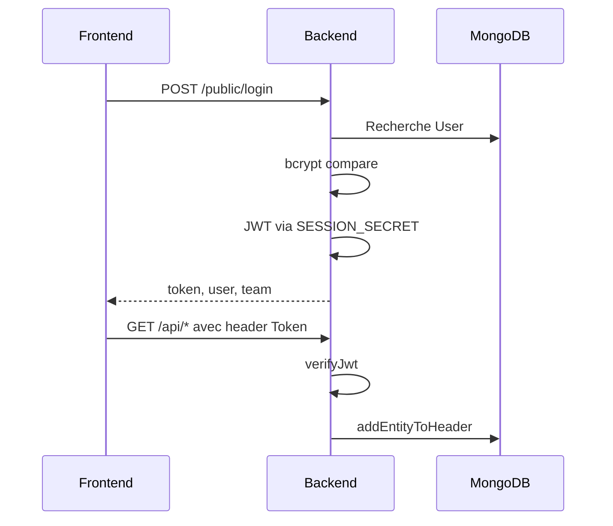

# Workflows système

## Authentification

## Création d'une opportunité

1. Le frontend appelle `POST /api/cards`.
2. Le backend vérifie le JWT et charge l'utilisateur et l'équipe.
3. Le body est validé par `CardRequestSchema`.
4. Le controller crée la `Card`.
5. Un événement `card` est émis.
6. Les listeners mettent à jour l'historique, le forecast et les références si nécessaire.

## Mise à jour d'une opportunité

1. Le frontend appelle `POST /api/cards/:id`.
2. Le backend récupère l'opportunité existante.
3. Les changements de lane, montant, nom, assignation, date ou attributs peuvent produire des événements.
4. Les événements alimentent l'activité et les vues forecast.

## Fusion de comptes

1. Le frontend appelle `POST /api/accounts/:id/merge`.
2. `AccountMergeService` valide que la fusion est autorisée.
3. Les références au compte source sont remplacées par le compte cible dans `Cards` et `Accounts`.
4. Les favoris utilisateurs sont mis à jour.
5. Les événements du compte source sont rattachés au compte cible.
6. Le compte source passe au statut `deleted`.

## Transfert d'opportunité

1. Un utilisateur crée une demande via `POST /api/opportunity-transfers`.
2. La demande est visible par les équipes concernées.
3. Le destinataire accepte ou refuse via `/accept` ou `/decline`.
4. Le statut passe à `accepted` ou `declined`, avec message de réponse optionnel.

## Job quotidien

Au démarrage du backend, `JobDailyScheduler` planifie `notifyOnMissedFollowUpDatesTimeline` à `10:00`. Le scheduler vérifie l'heure toutes les minutes et empêche deux exécutions simultanées du même job.

