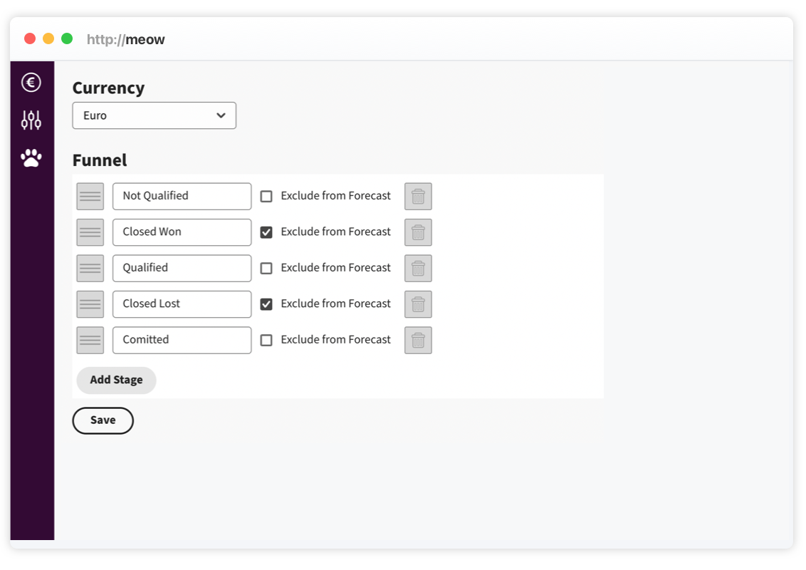
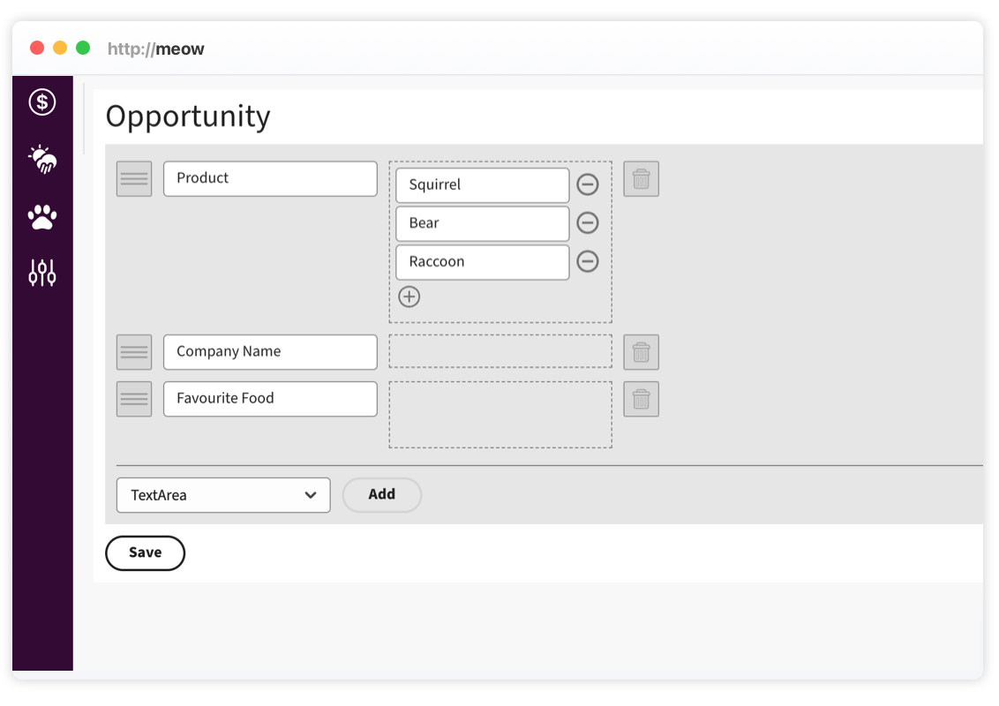
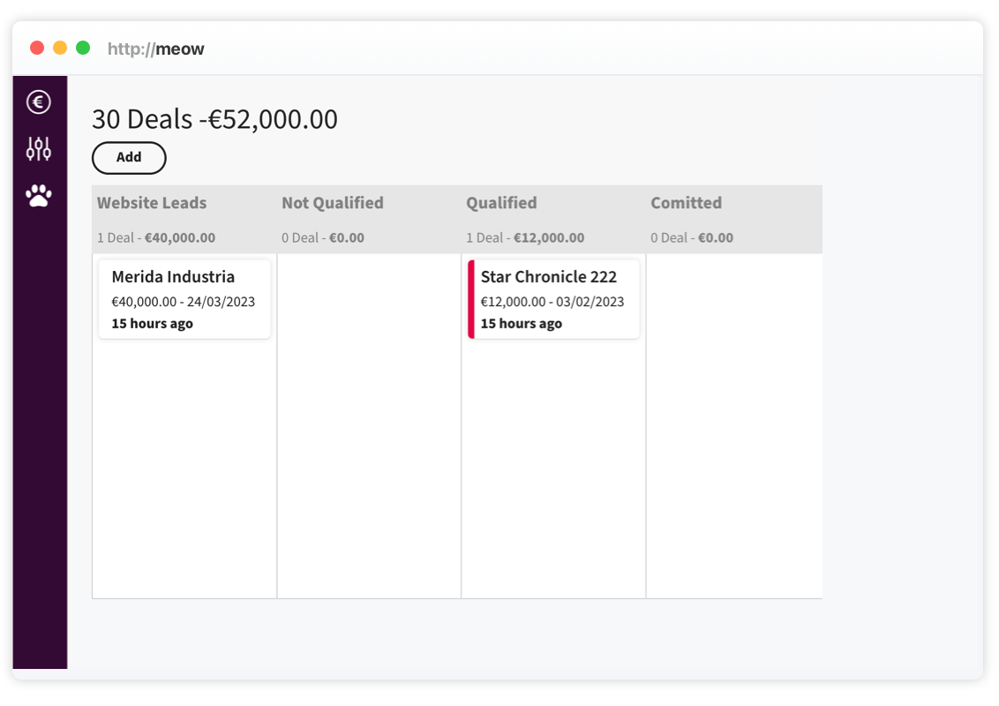

# Workflows utilisateur

## Configurer le funnel

1. Ouvrir `/setup`.
2. Ajouter, renommer ou réordonner les lanes.
3. Identifier les étapes de clôture gagnée/perdue si nécessaire.
4. Sauvegarder.



## Configurer les attributs d'opportunité

1. Ouvrir `/setup`.
2. Aller à la section opportunité.
3. Ajouter des attributs : texte, zone de texte, select, booléen, email, lien ou référence selon le schema.
4. Réordonner les attributs.
5. Sauvegarder.



## Créer un lead par API

1. Créer un utilisateur système dans `/setup`.
2. Créer une lane dédiée, par exemple `Website Leads`.
3. Appeler `POST /public/login`.
4. Appeler `POST /api/cards` avec le header `Token`.

```json
{
  "name": "Merida Industria",
  "amount": 40000,
  "laneName": "Website Leads"
}
```



## Créer un compte par API

1. Créer ou lire le schema account via `/api/schemas?type=account`.
2. Récupérer les clés d'attributs.
3. Appeler `POST /api/accounts`.

```json
{
  "name": "Merida Industria",
  "attributes": {
    "712f854e-73e1-1bec-cd54-7f920a846574": true
  }
}
```

## Transférer une opportunité

1. Ouvrir une fiche opportunité.
2. Aller dans l'onglet de transfert.
3. Choisir l'équipe cible.
4. Ajouter un message optionnel.
5. Créer la demande.
6. L'équipe destinataire accepte ou refuse depuis `/transfers`.

